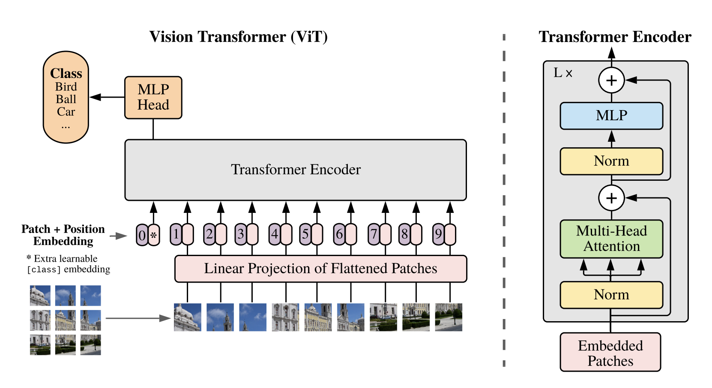

# Vision Transformer (ViT)
Implementation of Vision Transformer (ViT) in Pytorch. ViT is presented in the paper, [An Image is Worth 16x16 Words: Transformers for Image Recognition at Scale](https://openreview.net/forum?id=YicbFdNTTy).


# Implementation
The ViT code for this repo is based on the book ["Vision Transformer 入門"](https://gihyo.jp/book/2022/978-4-297-13058-9) written in Japanese. I added some code for dataset preparation and training procedures using [CIFAR10](https://www.cs.toronto.edu/~kriz/cifar.html).

# Usage
```
python run.py [-h] [-s SEED] FILE

positional arguments:
  FILE                  path to config file

options:
  -h, --help            show this help message and exit
  -s SEED, --seed SEED  seed for initializing training
```

# Example
```
python run.py examples/CIFAR10/config.ini
```

# Config
Here shows a list of settings and what they mean.
Parameters are based on the ViT experiment [conducted by GMO](https://recruit.gmo.jp/engineer/jisedai/blog/vision_transformer/).
```ini
[dataset]
dir = ./datasets	; training data save directory
name = CIFAR10		; dataset name, only CIFAR10 is acceptable
in_channels = 3		; number of channels
image_size = 32		; image size; 32x32
num_classes = 10	; 10 class classification

[dataloader]
batch_size = 32
shuffle = true

[model]
patch_size = 4		; use 4 x 4 px for patch
embed_dim = 256		; same meaning of dim=256 of `vit-pytorch`
num_blocks = 3		; same meaning of depth=3 of `vit-pytorch`
heads = 4			; number of multihead attention
hidden_dim = 256	; same meaning of mlp_dim=256 of `vit-pytorch`
dropout = 0.1		; dropout ratio

[learning]
epochs = 20
learning_rate = 0.001
```

# Result
ViT is inherently accurate when pre-trained on large image data sets (like [JFT-300M](https://paperswithcode.com/dataset/jft-300m)), so simply training on CIFAR10, as in this code, does not reduce cross-entropy loss.
```
[2022-09-23 11:52:17] :vision_transformer.utils.logger: [INFO] loss: 2.0047439576718755
[2022-09-23 11:52:38] :vision_transformer.utils.logger: [INFO] loss: 1.8455862294370755
...
[2022-09-23 11:58:37] :vision_transformer.utils.logger: [INFO] loss: 1.2203882005268012
[2022-09-23 11:58:58] :vision_transformer.utils.logger: [INFO] loss: 1.2218489825915986
```
This same has been shown in [GMO experiment](https://recruit.gmo.jp/engineer/jisedai/blog/vision_transformer/).
